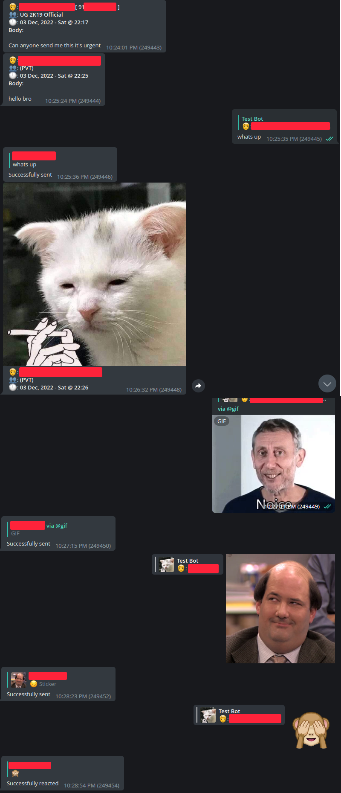
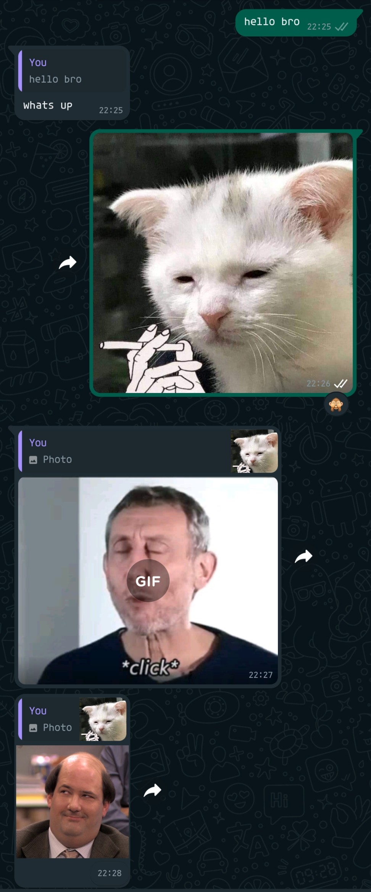

# WhatsApp-Telegram-Bridge

Despite the name, its not exactly a "bridge". It forwards messages from WhatsApp to Telegram and you can reply to them
from Telegram.

<a href="https://t.me/AkshettProjects">
  </img>
</a>&nbsp; &nbsp; 
<a href="https://t.me/WaTgBridge">
  </img>
</a>&nbsp; &nbsp; 

# DISCLAIMER !!!

This project is in no way affiliated with WhatsApp or Telegram. Using this can also lead to your account getting banned by WhatsApp so use at your own risk.

## Sample Screenshots

  
  

## Features and Design Choices

- All messages from various chats (on WhatsApp) are sent to different topics/threads within the same target group (on Telegram)
- Configuration options available to disable different types of updates from WhatsApp
- Can reply and send new messages from Telegram
- Can tag all people using @all or @everyone. Others can also use this in group chats which you specify in configuration file
- Can react to messages by replying with single instance of the desired emoji
- Supports static stickers from both ends
- Can send Animated (TGS) stickers from Telegram
- Video stickers from Telegram side are supported
- Video stickers from WhatsApp side are currently forwarded as GIFs to Telegram

## Bugs and TODO

- Document naming is messed up and not consistent on Telegram, have to find a way to always send sane names

PRs are welcome :)

## Installation

- Make a supergroup (enable message history for new members) with topics enabled
- Add your bot in the group, make it an admin with permissions to `Manage topics`
- Install `git`, `gcc` and `golang`, `ffmpeg` , `imagemagick` (optional), `libwebp` (latest version) on your system
- Clone this repository anywhere and navigate to the cloned directory
- Run `go build`
- Copy `sample_config.yaml` to `config.yaml` and fill the values, there are comments to help you.
- Execute the binary by running `./watgbridge`
- On first run, it will show QR code for logging into WhatsApp that can by scanned by the WhatsApp app in `Linked devices`
- It is recommended to restart the bot after every few hours becuase WhatsApp likes to disconnect a lot. So a sample Systemd service file has been provided (`watgbridge.service.sample`). Edit the `User` and `ExecStart` according to your setup:
    - If you do not have local bot API server, remove `tgbotapi.service` from the `After` key in `Unit` section.
    - This service file will restart the bot every 24 hours
