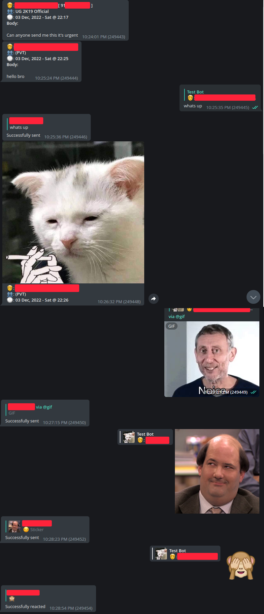
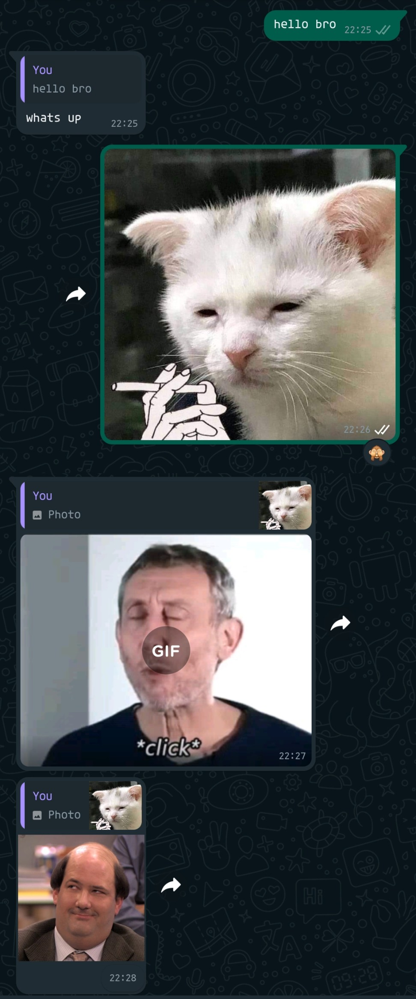

# WhatsApp-Telegram-Bridge

Despite the name, its not exactly a "bridge". It forwards messages from WhatsApp to Telegram and you can reply to them
from Telegram.

<a href="https://t.me/PropheCProjects">
  </img>
</a>&nbsp; &nbsp;
<a href="https://t.me/WaTgBridge">
  </img>
</a>&nbsp; &nbsp;
<a href="https://youtu.be/xc75XLoTmA4">
  
</a>

# DISCLAIMER !!!

This project is in no way affiliated with WhatsApp or Telegram. Using this can also lead to your account getting banned by WhatsApp so use at your own risk.

## Sample Screenshots

<p align="center">
  
  
</p>

## Features and Design Choices

- All messages from various chats (on WhatsApp) are sent to different topics/threads within the same target group (on Telegram)
- Configuration options available to disable different types of updates from WhatsApp
- Can reply and send new messages from Telegram
- Can tag all people using @all or @everyone. Others can also use this in group chats which you specify in configuration file
- Can react to messages by replying with single instance of the desired emoji
- Supports static stickers from both ends
- Can send Animated (TGS) stickers from Telegram
- Video stickers from Telegram side are supported
- Video stickers from WhatsApp side are currently forwarded as GIFs to Telegram
- Multi-user mode: one Main bot can manage many user bridges (`/bridge_add`, `/bridge_list`, `/bridge_enable`, `/bridge_disable`, `/bridge_delete`)
- Per-bridge bot token + per-bridge WhatsApp session support in multi mode
- Optional **SQLCipher** encryption for SQLite files using a server-held master secret (`WATG_SQLITE_MASTER_KEY`); see below

## Multi Mode (Main Bot)

- Set `mode: multi` (or `MODE=multi`) and provide `telegram.main_bot_token` (`TELEGRAM_MAIN_BOT_TOKEN`).
- Keep existing `single` mode unchanged for legacy setup.
- In multi mode, users talk to Main bot:
  - `/start` for onboarding instructions
  - `/bridge_add <bridge_bot_token> <target_chat_id> [label]` — optional `label` is for listing only; WhatsApp linked-device name is a random browser-style string
  - `/bridge_list`
  - `/bridge_enable <id>`
  - `/bridge_disable <id>`
  - `/bridge_delete <id>`
- On `/bridge_add`, bot validates bridge token/group permissions, creates topics (`General`, `Bot's meta`, `Calls`), enables bridge runtime, and returns management hints.
- With `WATG_SQLITE_MASTER_KEY` set, the main process derives a key for the **registry** SQLite (if `database.type: sqlite`); each **child** bridge process gets its own derived key via environment (not written into generated bridge YAML).

## Bugs and TODO

- Document naming is messed up and not consistent on Telegram, have to find a way to always send same names

PRs are welcome :)


## Installation

- Make a supergroup (enable message history for new members) with topics enabled
- Add your bot in the group, make it an admin with permissions to `Manage topics`
- Install `git`, **`gcc` and `g++`** (required for **CGO** / SQLCipher), `golang`, `ffmpeg`, `imagemagick` (optional), on your system
- Clone this repository anywhere and navigate to the cloned directory
- Run `CGO_ENABLED=1 go build` (CGO is required because SQLite uses [go-sqlcipher](https://github.com/mutecomm/go-sqlcipher))
- Copy `sample_config.yaml` to `config.yaml` and fill the values, there are comments to help you.
- Execute the binary by running `./watgbridge`
- On first run, it will show QR code for logging into WhatsApp that can by scanned by the WhatsApp app in `Linked devices`
- It is recommended to restart the bot after every few hours becuase WhatsApp likes to disconnect a lot. So a sample Systemd service file has been provided (`watgbridge.service.sample`). Edit the `User` and `ExecStart` according to your setup:
    - If you do not have local bot API server, remove `tgbotapi.service` from the `After` key in `Unit` section.
    - This service file will restart the bot every 24 hours

## SQLite encryption (optional)

Bridge and WhatsApp session data often live in **SQLite**. You can encrypt those files at rest with **SQLCipher** by setting environment variables (see [`.env.example`](.env.example)):

| Variable | Meaning |
|----------|---------|
| `WATG_SQLITE_MASTER_KEY` | 64 hex characters (32 bytes). When set, the binary derives per-context keys with HKDF and applies `PRAGMA key` when opening SQLite. |
| `WATG_SQLCIPHER_KEY_HEX` | Normally **unset**; the parent sets this for child bridge processes. Advanced/testing only if you set it yourself. |

**Derivation contexts** (stable strings in code): single-process mode uses `watgbridge-v1/single` for your GORM DB and sqlite3 whatsmeow store; multi mode uses `watgbridge-v1/registry` for the main registry DB and `watgbridge-v1/bridge/<id>` for each spawned bridge.

**Important:** Existing **plaintext** `.db` / `.sqlite.db` files will not open once you enable a key for that path. Back them up, then recreate or plan a migration. Stricter ops (rotation, KMS, separate keys per store) are tracked in [`features-plan.md`](features-plan.md).

## Docker Compose

The container expects **`./config.yaml` on the host** (bind-mounted to `/data/config.yaml`). Use **`./run.sh`** from the repo root: it runs `envsubst` on [`docker/config.yaml.tpl`](docker/config.yaml.tpl), writes `config.yaml`, then `docker compose up -d`. Requires **gettext** (`envsubst`).

**Single bridge**

```bash
./run.sh \
  --telegram-bot-token 'TOKEN' \
  --telegram-owner-id '123456789' \
  --telegram-target-chat-id '-100xxxxxxxxxx' \
  --build
```

**Multi-tenant** (main bot only; users run `/bridge_add` with each bridge’s bot token and target group)

```bash
./run.sh \
  --mode multi \
  --telegram-main-bot-token 'MAIN_BOT_TOKEN' \
  --build
```

Optional: set `MODE=multi` and `TELEGRAM_MAIN_BOT_TOKEN` in `.env` instead of flags. Optional SQLCipher: `WATG_SQLITE_MASTER_KEY` in `.env` (passed through `docker-compose.yml`).

If you already have a hand-written `config.yaml`, you can run `docker compose up -d` (or `--build`) directly; `run.sh` is not required.

Session and registry data live on the `sqlite_data` volume (`/data` in the app). **Redis** in compose is optional for multi mode (the main process exits before connecting to Redis; bridge children can use it if you add `REDIS_ADDR` to their generated config later). The image is built with **CGO** and Alpine-specific compiler flags for SQLCipher (see [`Dockerfile`](Dockerfile)). To encrypt volumes at rest, set `WATG_SQLITE_MASTER_KEY` in the same way as for a bare-metal install (compose `environment` or env file).

## Continuous integration

GitHub Actions build **release binaries with CGO** (Linux amd64 and cross-compiled arm64). Workflow layout and CGO notes: [`.github/CI.md`](.github/CI.md).

## Code structure

```
watgbridge/
├── main.go                 # Entry: flags, viper config, logger, DB, Telegram, WhatsApp, cron, Idle()
├── state/                  # Global state + config
├── database/               # GORM + chat/msg/contact persistence
├── telegram/               # Telegram bot client + commands + startup check
├── whatsapp/               # WhatsApp (whatsmeow) client + event handling
├── utils/                  # Shared helpers (TG, WA, stickers, net)
├── modules/                # Pluggable handlers (Telegram + WA)
├── docker/                 # Docker entrypoint + config template
├── docker-compose.yml
├── run.sh
├── sample_config.yaml
├── features-plan.md         # Backlog (encryption hardening, etc.)
├── crypto/sqlitekey/        # HKDF + PRAGMA helpers for SQLCipher keys
├── internal/gormsqlcipher/  # GORM dialector using go-sqlcipher (no mattn in app imports)
└── .github/
    ├── CI.md                # CI / CGO documentation
    └── workflows/           # build, nix cache
```

| Package | Role |
|--------|------|
| **main** | Parses flags (pflag), loads config via **state.InitConfig** (viper: file → env → flags), builds logger, connects DB, starts **telegram.NewTelegramClient()**, runs **telegram.CheckTargetGroupPermissions()**, starts **whatsapp.NewWhatsAppClient()**, registers handlers, optional startup message, then **updater.Idle()**. |
| **state** | Single **State** (config, logger, DB, Telegram bot/dispatcher/updater, WhatsApp client, modules list, start time, location). **config.go**: Config struct, Load/Save YAML, SetDefaults. **viper.go**: InitConfig (defaults → file → env → flag bindings), unmarshal into State.Config. **state.go**: State struct + init. |
| **database** | **connect.go**: Connect() by type (postgres/sqlite/mysql). SQLite uses **internal/gormsqlcipher** + optional SQLCipher `PRAGMA key` when `WATG_SQLCIPHER_KEY_HEX` is set (usually derived from `WATG_SQLITE_MASTER_KEY`). **types.go**: GORM models + AutoMigrate. **helpers.go**: MsgId pairs (WA↔TG), ChatThread pairs (WA chat ↔ TG topic), contacts, ephemeral settings. |
| **telegram** | **client.go**: NewTelegramClient() — create bot, middlewares, dispatcher, updater, StartPolling. **handlers.go**: All bot commands (start, getwagroups, findcontact, settargetgroupchat, settargetprivatechat, unlinkthread, send, help, updateandrestart, etc.). **check_target.go**: CheckTargetGroupPermissions() — GetChat (forum?), GetChatMember (admin + Manage topics), log + send to target group and owner on failure. **middlewares/**: rate limit, parse HTML, disable preview, send without reply. **constants.go**: handler group IDs. |
| **whatsapp** | **client.go**: NewWhatsAppClient() (whatsmeow, sqlstore, QR if needed), AddEventHandler(WhatsAppEventHandler). **handlers.go**: One big **WhatsAppEventHandler** that switches on event type (messages, status, reactions, presence, etc.), resolves WA chat → TG topic via DB, calls **utils.TgSendToWhatsApp** for replies and **utils** for sending to WA. |
| **utils** | **telegram.go**: TgGetOrMakeThreadFromWa, TgReplyTextByContext, TgSendErrorById, **TgSendToWhatsApp** (main “reply from TG to WA” flow), revoke keyboard, etc. **whatsapp.go**: WaParseJID, WaFuzzyFindContacts, WaGetContactName, WaSendText, WaTagAll. **stickers.go**: TGS→WebP, WebM→WebP, animated WebP→GIF. **net.go**: Download by URL. **go.go**: SubString. |
| **modules** | **load.go**: Registers optional Telegram and WhatsApp handlers from **TelegramHandlers** map and **WhatsAppHandlers** slice; called after telegram/whatsapp handlers so modules can extend both sides. Default build has no modules (empty maps). |

**Data flow**

- **Config**: Viper (defaults → YAML → env → flags) → **state.State.Config**.
- **WA → TG**: WhatsApp event in **whatsapp/handlers.go** → DB (ChatThreadGetTgFromWa, MsgIdAddNewPair, etc.) → **utils** (TgSend*, CreateForumTopic) → send to **State.Config.Telegram.TargetChatID** in the right topic.
- **TG → WA**: User reply in Telegram → **telegram/handlers** (SendToWhatsAppHandler) → DB (MsgIdGetWaFromTg, ChatThreadGetWaFromTg) → **utils.TgSendToWhatsApp** → whatsmeow send.

**Docker / deploy**

- **docker/entrypoint.sh**: Envsubst from **config.yaml.tpl** → `/data/config.yaml`, then `./watgbridge /data/config.yaml`.
- **docker-compose.yml**: `db` (Alpine, volume) + `watgbridge` (build ., env vars, shared volume `sqlite_data` at `/data`).
- **run.sh**: Parses named args, exports env, runs `docker compose up -d` (optionally `--build`).
- **Dockerfile**: multi-stage build with `CGO_CFLAGS` for musl so SQLCipher’s bundled SQLite compiles on Alpine.
