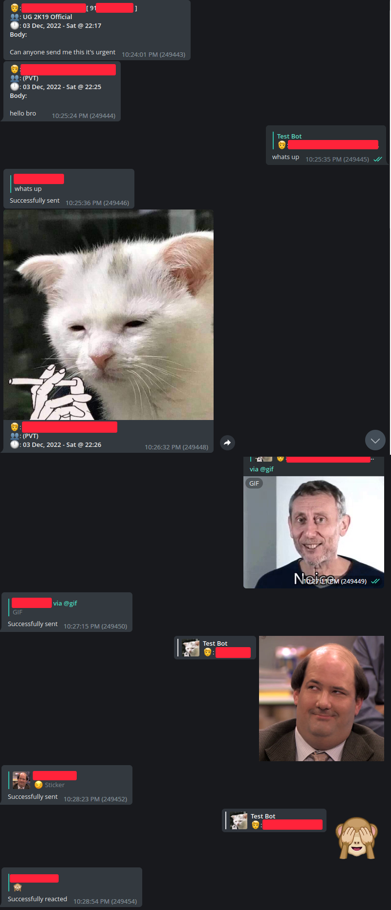
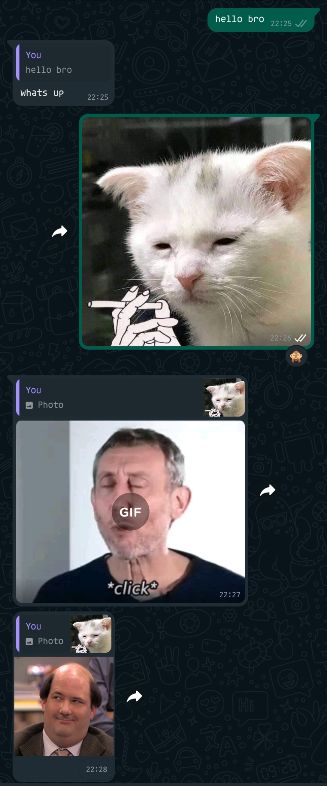

# WhatsApp-Telegram-Bridge

<a href="https://t.me/PropheCProjects">
  </img>
</a>&nbsp; &nbsp;
<a href="https://t.me/WaTgBridge">
  </img>
</a>&nbsp; &nbsp;
<a href="https://youtu.be/xc75XLoTmA4">
  </img>
</a>

A message-forwarding bridge that connects WhatsApp and Telegram. It allows you to receive WhatsApp messages in a Telegram group (organized by topics/threads) and reply to them directly from Telegram.

## Disclaimer

This project is in no way affiliated with WhatsApp or Telegram. Using this tool may violate WhatsApp's Terms of Service and could lead to your account getting banned. Use at your own risk.

## Screenshots

<p align="center">
  
  
</p>

## Key Features

* **Topic-Based Organization:** Each WhatsApp chat is mapped to a dedicated topic/thread within a single Telegram supergroup.
* **Two-Way Message Editing:** Edit messages or update image/video captions on Telegram to mirror them to WhatsApp, and vice versa.
* **Flexible Client Emulation:** Emulate an Android Phone or Android Business client to bypass WhatsApp's web client restrictions, enabling receipt and decryption of view-once media.
* **Robust Media Support:** 
  * Static sticker bridging in both directions.
  * Animated sticker conversion (WEBM and WebP formats supported).
  * Auto-transcoding of Telegram audio files into WhatsApp-compatible formats.
  * Optional configuration to bridge WhatsApp stickers and images as uncompressed documents.
* **Reactions and Receipts:** 
  * Reply to bridged messages with a single emoji on Telegram to react on WhatsApp.
  * Automatic read receipt tracking with a `/info` command to check delivery status.
* **Group Management:** List group members with their phone numbers using `/findgroupmembers` and configure `@all` / `@everyone` tags for specific groups.
* **Automated Backups:** Configure automatic database backups using cron schedule expressions.

## Installation

### Prerequisites

You will need the following installed on your system:
* Git
* GCC and Go (1.25 or later recommended)
* Ffmpeg
* ImageMagick (optional)

### Setup Steps

1. Create a Telegram supergroup with topics enabled.
2. Add your Telegram bot to the group and promote it to administrator with permissions to manage topics.
3. Clone this repository:
   ```bash
   git clone https://github.com/akshettrj/watgbridge.git
   cd watgbridge
   ```
4. Build the application:
   ```bash
   go build
   ```
5. Copy the configuration template and fill in your settings:
   ```bash
   cp sample_config.yaml config.yaml
   ```
6. Run the application:
   ```bash
   ./watgbridge
   ```
7. On the first run, scan the QR code printed in the terminal or sent to your Telegram owner chat using your WhatsApp mobile app under "Linked devices".

It is recommended to configure a supervisor/init service to automatically restart the bot if it disconnects. A template systemd service file is provided in `watgbridge.service.sample`.

## Running with Docker

You can run the bridge inside a Docker container using the pre-built images or Docker Compose.

### Prerequisites

Create a folder for configuration and database files, and place your configured `config.yaml` in it. The container will generate and write to the following database files:
* `gobot.sqlite.db`
* `wawebstore.db`

### Docker Run

Pull the official image:
```bash
docker pull ghcr.io/akshettrj/watgbridge:last
```

Run the container:
```bash
docker run -d \
  --name watgbridge \
  --restart unless-stopped \
  -v $(pwd)/config.yaml:/go/src/watgbridge/config.yaml \
  -v $(pwd)/gobot.sqlite.db:/go/src/watgbridge/gobot.sqlite.db \
  -v $(pwd)/wawebstore.db:/go/src/watgbridge/wawebstore.db \
  -v $(pwd)/.git:/go/src/watgbridge/.git \
  ghcr.io/akshettrj/watgbridge:last
```

### Docker Compose

A sample compose file is available at `docker-compose.yml.sample`. You can copy it to `docker-compose.yml` and adjust the volumes or environment variables as needed, then start it using:
```bash
docker compose up -d
```
